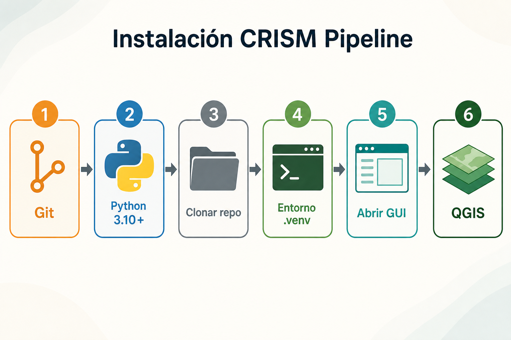
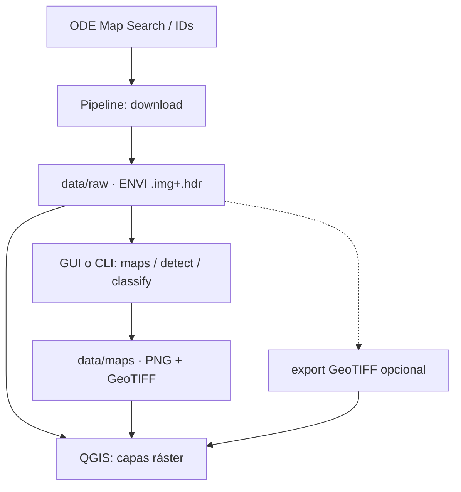
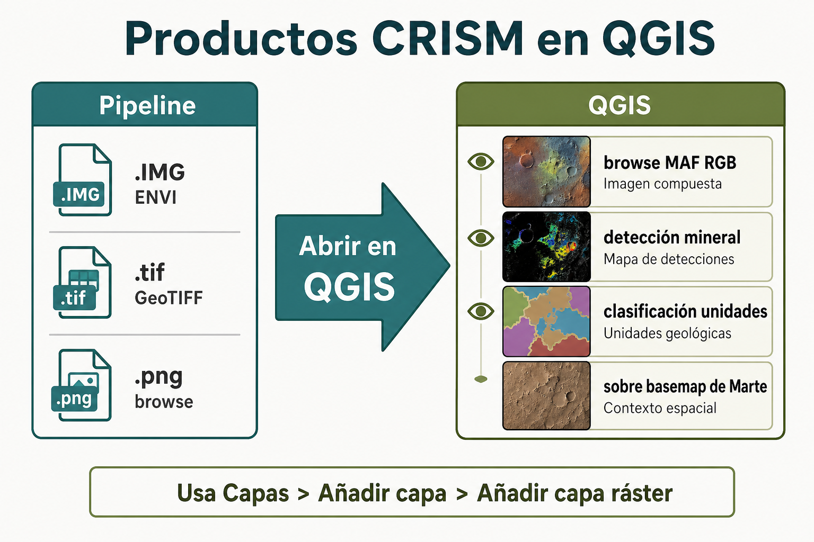

# 2. Guía de instalación (de cero a GUI)

Manual para **cualquier persona** que clone el repositorio y quiera dejar el **CRISM Pipeline** listo para usar: entorno Python, interfaz gráfica y **QGIS** para visualizar los productos geoespaciales.




> **Tiempo estimado:** 20–40 minutos (según velocidad de descarga).  
> **Sistema pensado primero:** Windows 10/11. También funciona en Linux y macOS (se indican las diferencias).

---

## 2.1 Qué vas a instalar y para qué

| Herramienta | Rol en el flujo | ¿Obligatoria? |
|-------------|-----------------|---------------|
| **Git** | Clonar el código desde GitHub | Sí |
| **Python 3.10+** | Ejecutar el pipeline y la GUI | Sí |
| **CRISM Pipeline** (este repo) | Descargar y analizar cubos CRISM MTRDR SR | Sí |
| **QGIS** | Abrir `.IMG` / GeoTIFF / PNG en un GIS | Recomendada |

**Flujo típico de trabajo:**



---

## 2.2 Requisitos del equipo

| Recurso | Mínimo razonable | Nota |
|---------|------------------|------|
| Sistema | Windows 10/11, Linux o macOS | La GUI usa CustomTkinter |
| RAM | 8 GB | Escenas grandes se benefician de más |
| Disco libre | ~5 GB para herramientas + **~2 GB por escena CRISM** | SR + derivados |
| Red | Acceso a Internet | Clonar, `pip`, descargas ODE |
| Pantalla | 1280×720 o superior | Para la GUI |

---

## 2.3 Software previo: enlaces y versiones

### A) Git (control de versiones)

| | |
|--|--|
| **Versión** | Cualquiera reciente (2.40+ está bien) |
| **Descarga** | [https://git-scm.com/downloads](https://git-scm.com/downloads) |
| **Windows** | Instala *Git for Windows*. En el asistente puedes dejar las opciones por defecto. |

**Comprobar:**

```powershell
git --version
```

Ejemplo de salida válida: `git version 2.45.1.windows.1`

---

### B) Python 3.10 o superior

| | |
|--|--|
| **Versión requerida** | **≥ 3.10** (el proyecto declara `requires-python = ">=3.10"`) |
| **Recomendada** | **3.11** o **3.12** (estables y bien soportadas) |
| **Descarga oficial** | [https://www.python.org/downloads/](https://www.python.org/downloads/) |

**En Windows (importante):**

1. Descarga el instalador de la versión elegida (64-bit).
2. En la **primera pantalla** del instalador, marca:
   - **Add python.exe to PATH**
3. Elige *Install Now* (o *Customize* si quieres cambiar la carpeta).
4. Cierra y **abre una terminal nueva** (PowerShell o CMD) para que cargue el PATH.

**Comprobar:**

```powershell
python --version
pip --version
```

Debes ver algo como `Python 3.11.x` o `Python 3.12.x`.

> Si `python` no se reconoce, prueba `py --version` (lanzador de Windows) o reinstala marcando *Add to PATH*.

**Linux / macOS:** usa el gestor de paquetes o [python.org](https://www.python.org/downloads/). En macOS también es habitual `brew install python@3.12`.

---

### C) QGIS (SIG para productos CRISM)

| | |
|--|--|
| **Versión recomendada** | **QGIS 3.34 LTR** o la **última estable 3.x** del sitio oficial |
| **Descarga** | [https://qgis.org/download/](https://qgis.org/download/) |
| **Windows** | Usa el instalador **OSGeo4W** o el instalador standalone de QGIS |

QGIS **no** es necesario para que el pipeline descargue o genere mapas; sí lo es si quieres **superponer, medir, reclasificar o combinar** capas con basemaps marcianos u otros datos GIS.

**Usos típicos con este proyecto:**

| Producto del pipeline | Ubicación habitual | Qué hacer en QGIS |
|-----------------------|--------------------|-------------------|
| Cubo SR ENVI | `data/raw/…/*.IMG` | Abrir como **capa ráster** (abre el `.IMG`, no el `.hdr`) |
| GeoTIFF exportado | `data/processed/*.tif` | Capa ráster multibanda (60 índices) |
| Browse products | `data/maps/…/browse/*.png` o `.tif` | Vista RGB (MAF, PHY, HYD, …) |
| Detecciones | `data/maps/…/detection/*.tif` | Máscaras binarias por mineral |
| Clasificación | `data/maps/…/classification/*` | Mapa de unidades geológicas |



---

## 2.4 Paso a paso: clonar e instalar el pipeline

### Paso 1 — Elegir carpeta de trabajo

Abre PowerShell y ve a donde quieras el proyecto (ejemplo):

```powershell
cd $HOME\Documents
```

### Paso 2 — Clonar el repositorio

```powershell
git clone https://github.com/Rafit4/SemilleroCavernasGCPA.git
cd SemilleroCavernasGCPA
```

Tras el `cd`, tu prompt debe estar **dentro** de la carpeta del proyecto (donde están `README.md`, `pyproject.toml`, `abrir_gui.bat`, etc.).

> Si ya lo clonaste antes: `cd` a esa carpeta y, si quieres actualizar, `git pull`.

### Paso 3 — Crear un entorno virtual (`.venv`)

El entorno virtual aísla las dependencias del resto del sistema:

```powershell
python -m venv .venv
```

**Activarlo (Windows):**

```powershell
.\.venv\Scripts\activate
```

Cuando esté activo, verás `(.venv)` al inicio de la línea.

| Sistema | Activación |
|---------|------------|
| Windows (PowerShell) | `.\.venv\Scripts\activate` |
| Windows (CMD) | `.venv\Scripts\activate.bat` |
| Linux / macOS | `source .venv/bin/activate` |

### Paso 4 — Instalar el paquete y dependencias

Con el entorno **activado**:

```powershell
python -m pip install --upgrade pip
pip install -e .
```

`pip install -e .` lee `pyproject.toml` e instala el proyecto en modo *editable* (cambios en el código se reflejan sin reinstalar).

**Dependencias principales que se instalan** (versiones mínimas del proyecto):

| Paquete | Versión mínima | Uso |
|---------|----------------|-----|
| `numpy` | ≥ 1.24 | Arrays / cubos |
| `scipy` | ≥ 1.10 | Cálculos numéricos |
| `spectral` | ≥ 0.23 | Lectura ENVI / espectral |
| `rasterio` | ≥ 1.3 | GeoTIFF / GIS |
| `matplotlib` | ≥ 3.7 | Figuras y espectros |
| `pyyaml` | ≥ 6.0 | Configuración |
| `scikit-learn` | ≥ 1.3 | Clasificación |
| `tqdm` | ≥ 4.65 | Barras de progreso |
| `h5py` | ≥ 3.9 | HDF5 (legado / API) |
| `pandas` | ≥ 2.0 | Tablas / CSV |
| `customtkinter` | ≥ 5.2 | GUI moderna |
| `pillow` | ≥ 10.0 | Imágenes en GUI |
| `markdown` | ≥ 3.5 | Docs en la GUI |
| `tkinterweb` | ≥ 3.0 | Vista HTML de documentación |

También puedes instalar desde lista explícita (equivalente práctico):

```powershell
pip install -r requirements.txt
pip install -e .
```

### Paso 5 — Verificar la instalación

Con `(.venv)` activo:

```powershell
python -m crism_pipeline --help
```

Debes ver la ayuda del CLI (`download`, `maps`, `detect`, `classify`, `run`, `export`, …).

Comprobar también el entry-point de la GUI:

```powershell
crism-pipeline-gui --help
```

(Si el comando existe, el paquete quedó registrado correctamente; la GUI se abre sin `--help` — ver sección siguiente.)

---

## 2.5 Abrir la interfaz gráfica (GUI)

Tienes **tres formas** equivalentes. Usa la que te resulte más cómoda.

### Opción A — Doble clic (Windows, la más simple)

1. En el Explorador de archivos, abre la carpeta del proyecto.
2. Doble clic en **`abrir_gui.bat`**.

El script usa el Python de `.venv` (si existe), configura `PYTHONPATH` y lanza la GUI. Si falla, deja el mensaje en pantalla y pide una tecla.

### Opción B — Comando tras `pip install -e .`

```powershell
cd ruta\a\SemilleroCavernasGCPA
.\.venv\Scripts\activate
crism-pipeline-gui
```

### Opción C — Módulo Python

```powershell
cd ruta\a\SemilleroCavernasGCPA
.\.venv\Scripts\activate
$env:PYTHONPATH = "src"   # PowerShell; en CMD: set PYTHONPATH=src
python -m crism_pipeline.gui
```

Cuando la ventana se abra, verás la cabecera **GCPA**, pestañas (Descarga, Mapas, Detección, …) y el registro de mensajes.

Manual de uso de la interfaz: [08_manual_gui.md](08_manual_gui.md).

---

## 2.6 Instalar y usar QGIS con productos CRISM

### Instalación

1. Entra a [https://qgis.org/download/](https://qgis.org/download/).
2. Descarga el instalador de tu sistema (Windows: standalone o OSGeo4W).
3. Instala con opciones por defecto.
4. Abre **QGIS Desktop** desde el menú Inicio.

### Abrir un cubo o mapa del pipeline

1. En QGIS: **Capa → Añadir capa → Añadir capa ráster…**  
   (o arrastra el archivo al panel de capas).
2. Elige, según el caso:
   - **`data/raw/<escena>/*.IMG`** — cubo SR ENVI (60 bandas con nombre; incluye CRS si el header trae `map info`).
   - **`data/processed/<PRODUCT_ID>.tif`** — GeoTIFF exportado con la pestaña/comando **Exportar**.
   - **`data/maps/<product_id>/browse/*.tif` o `*.png`** — browse products RGB.
   - **`data/maps/<product_id>/detection/*.tif`** — máscaras de minerales.
3. Ajusta simbología (estilos, bandas RGB, transparencia) según el producto.

> **Tip:** en productos ENVI, abre el **`.IMG`**, no el `.hdr`. El header se lee automáticamente.

### Exportar GeoTIFF desde el pipeline (opcional)

Si prefieres GeoTIFF en lugar del ENVI nativo:

**GUI:** pestaña **Exportar** → selecciona la carpeta en `data/raw` → **Exportar GeoTIFF**.

**CLI:**

```powershell
python -m crism_pipeline export --input data/raw/frt000084c9_07_if166j_mtr3
```

Salida típica: `data/processed/<PRODUCT_ID>.tif`.

---

## 2.7 Checklist final (“ya está instalado”)

Marca mentalmente:

- [ ] `git --version` responde
- [ ] `python --version` muestra **3.10 o superior**
- [ ] Repositorio clonado y estás en su carpeta raíz
- [ ] `.venv` creado y activado (`(.venv)` visible)
- [ ] `pip install -e .` terminó sin error
- [ ] `python -m crism_pipeline --help` funciona
- [ ] La GUI abre (`abrir_gui.bat` o `crism-pipeline-gui`)
- [ ] QGIS instalado y puedes añadir una capa ráster de prueba

Si todos los puntos pasan, la herramienta está lista para descargar escenas desde ODE y analizarlas.

Siguiente lectura recomendada: [03_descarga.md](03_descarga.md) y [08_manual_gui.md](08_manual_gui.md).

---

## 2.8 Archivos de configuración (después de instalar)

No hace falta editarlos para la primera prueba; sirven cuando personalices el análisis.

### `config/pipeline.yaml`

| Sección | Propósito |
|---------|-----------|
| `ode` | Parámetros de la API REST de ODE |
| `paths` | Rutas de datos (`raw`, `processed`, `maps`, `models`) |
| `stretch` | Estiramiento para visualización (Viviano §5.3) |
| `classification` | Features por defecto, número de clusters |
| `detection` | Percentil de umbral por defecto |

### `config/viviano2014.yaml`

| Sección | Propósito |
|---------|-----------|
| `browse_products` | Definición RGB de cada browse product |
| `mineral_groups` | Índice principal por grupo mineral |
| `mineral_detection` | Reglas AND para detección binaria |
| `unit_signatures` | Firmas espectrales para clasificación |

Las rutas del pipeline son **relativas a la raíz del proyecto**; no necesitas variables de entorno obligatorias.

---

## 2.9 Personalización rápida (opcional)

### Añadir un mineral a detección

Editar `config/viviano2014.yaml`:

```yaml
mineral_detection:
  mi_mineral:
    conditions:
      - index: D2300
        threshold_mode: percentile
        threshold: 90
      - index: BD2210_2
        threshold_mode: percentile
        threshold: 85
```

Luego:

```powershell
python -m crism_pipeline detect --input data/raw/mi_escena --mineral mi_mineral
```

### Cambiar features de clasificación

En `config/pipeline.yaml`, sección `classification.default_features`.

---

## 2.10 Solución de problemas

| Síntoma | Causa probable | Qué hacer |
|---------|----------------|-----------|
| `python` no se reconoce | PATH sin Python | Reinstalar Python con **Add to PATH**; abrir terminal nueva |
| `git` no se reconoce | Git no instalado / PATH | Instalar desde [git-scm.com](https://git-scm.com/downloads) |
| `No module named 'crism_pipeline'` | Entorno no activado o sin `pip install -e .` | Activar `.venv` y repetir `pip install -e .` |
| `No module named 'customtkinter'` | Dependencias GUI incompletas | `pip install customtkinter pillow tkinterweb markdown` |
| `abrir_gui.bat` cierra con error | `.venv` inexistente o instalación incompleta | Crear `.venv`, `pip install -e .`, volver a abrir |
| `rasterio` falla al crear GeoTIFF | Header sin proyección | Normal en algunos productos; el PNG igual se genera |
| `Banda 'X' no encontrada` | Nombre distinto en `.hdr` | Revisar `band names` del header ENVI |
| Descarga ODE muy lenta | Muchos archivos por producto | En pruebas: limitar con `--max-products` |
| QGIS no georeferencia bien | Sin `map info` / CRS aproximado | Usar label PDS del MTRDR para proyección MRO precisa |

---

## 2.11 Resumen de enlaces

| Recurso | URL |
|---------|-----|
| Repositorio | [https://github.com/Rafit4/SemilleroCavernasGCPA](https://github.com/Rafit4/SemilleroCavernasGCPA) |
| Git | [https://git-scm.com/downloads](https://git-scm.com/downloads) |
| Python | [https://www.python.org/downloads/](https://www.python.org/downloads/) |
| QGIS | [https://qgis.org/download/](https://qgis.org/download/) |
| ODE (datos CRISM) | [https://oderest.rsl.wustl.edu/](https://oderest.rsl.wustl.edu/) |
| Paper Viviano 2014 | [doi:10.1002/2014JE004627](https://doi.org/10.1002/2014JE004627) |
